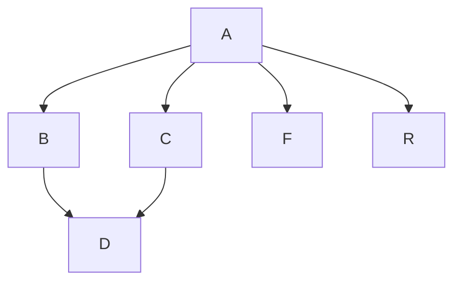

# task

How to start this task

Please this is not required clone to your local machine. It is automatically downloaded for you. Please follow next step

Open TASK.pdf file on browser

Open bash terminal

Make sure you have wget command installed

If wget command not installed, you have to come back repository and download only start.sh and execute it terminal.

Follow instructions on TASK.pdf file

| Commands | Description |
|----------|----------|
| **wget url** | Downloading script and installing to local |
| **bash start.sh** | Executing start file it creates project |
| **cd task** | Change directory and start the task |

```bash
wget https://raw.githubusercontent.com/102vosit/task/master/start.sh
bash start.sh
cd task/
```


